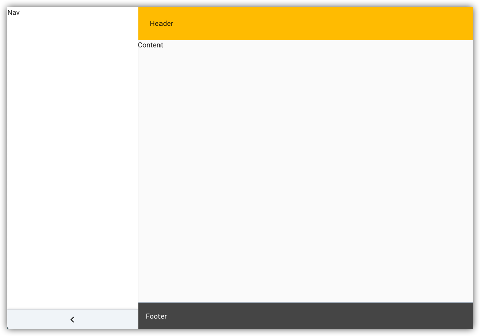
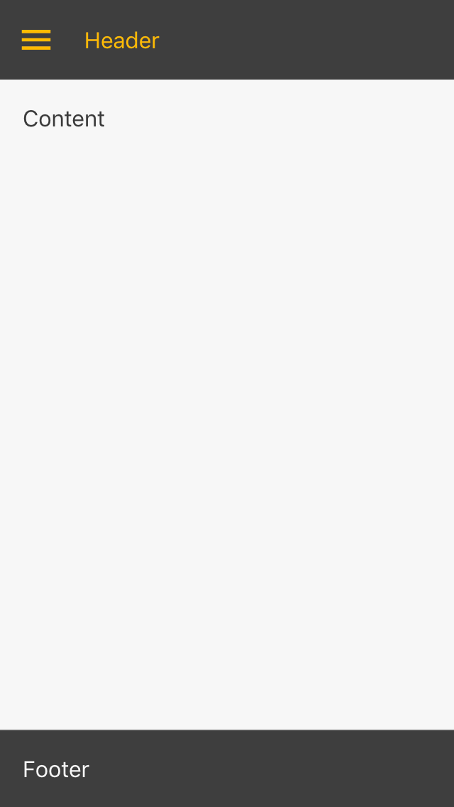

# Committed Components Layout

[](https://committed.io)
[](https://drone.committed.software/commitd/layout)

This is a simple layout for standard looking material based apps, based on [Mui Layout](https://mui-treasury.com/components/layout)
but using `@committed/components` as its base.

<p align="center">
  
</p>

## 🔗 Live Demo

Here's a [live demo](https://committed.software/docs)

## 🚀 Quickstart

For use with [`@committed/components`](https://github.com/commitd/components),

```bash
yarn add @committed/layout
```

add any missing peer dependencies

```bash
yarn add @committed/components @material-ui/core @material-ui/icons react react-dom
```

### Usage

```tsx
import React from 'react'
import ReactDOM from 'react-dom'
import { ThemeProvider } from '@committed/components'
import { Root, Header, Nav, Content, Footer } from '/layout'

const App = () => (
  <ThemeProvider>
    <Root
      style={{ minHeight: '100vh' }}
      config={
        {
          // adjust behavior here!
          // See LayoutConfig
        }
      }
    >
      <Header>Header</Header>
      <Nav
        header={
          // you can provide fixed header inside nav
          // change null to some react element
          ctx => null
        }
      >
        Nav
      </Nav>
      <Content>Content</Content>
      <Footer>Footer</Footer>
    </Root>
  </ThemeProvider>
)

ReactDOM.render(<App />, document.getElementById('root'))
```

## 📱 Responsive

The layout adjusts for small screen sizes.

<p align="center">
  
</p>

## 📝 Config

For each config parameter a single value or an object with breakpoint keys can be supplied, e.g.

```javascript
const config = {
  navWidth: {
    // xs is 256px by default
    sm: 200, // in sm
    md: 256 // mdUp
  }
}
```

## 💻 Development

On first use run `yarn install` in both the root folder and the example folder.

The main build is currently performed using Rollup:

```bash
yarn build
```

For development use

```bash
yarn start
```

the same command can be run in the example folder to run a usage example.

## 🤖 CI

Pull requests go through CI checks using GitHub actions.

## 👏 Credit

It is based on Mui Layout from https://mui-treasury.com/
for further reference see https://github.com/siriwatknp/mui-layout.

## ©️ License

[MIT](/LICENSE) - © Committed Software 2019 <https://committed.io>
